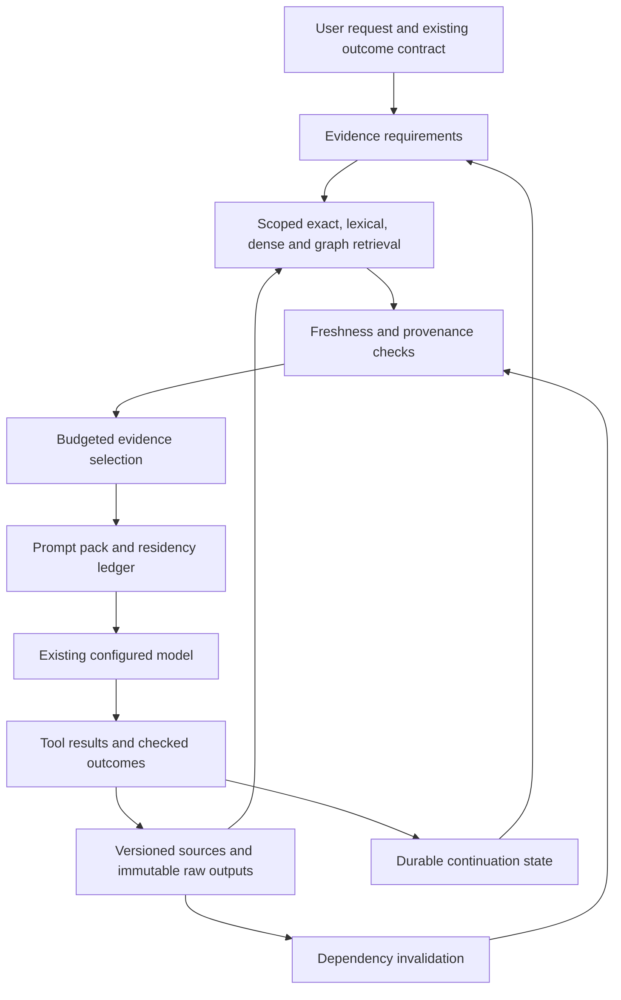

# RAG and context: a compiler for current, sufficient evidence

Date: 2026-09-14. Status: **audit and Target proposal**. No retrieval, model, or context runtime was changed. This report proposes a major upgrade using the currently configured generation, embedding, and reranking models. Expected benefits are hypotheses until the experiments below pass.

## Decision

Build a **Context Compiler** between Bimax's existing stores/tools and prompt assembly. Its output is a bounded, versioned evidence package for the next action: the exact relevant passages, their dependencies, unresolved questions, and the durable task state. Treat retrieval, freshness, selection, and compaction as one system with explicit contracts.

The reason is concrete. Bimax can retrieve the right memory document and then omit the answering passage from the prompt. It can retain stale recall through compaction, restore changed bytes as “verified unchanged,” and exceed a declared context budget. These are information-flow defects that a stronger model cannot reliably repair after the evidence has been discarded or mislabelled.

The differentiating proposal is **incremental context repair**: when a source changes, invalidate and rebuild just the affected evidence, conclusions, and prompt sections. Pair this with retrieval for missing evidence relationships, a real token allocator, and a queryable archive. Individual ingredients have precedents; this report does not claim a new mathematical discovery or globally unique product feature.

## Scope, sources, and limits

Local inspection covered code indexing, JSON and SQLite retrieval, BM25, automatic recall, project memory, document ingestion, numeric facts, visual retrieval, graph ranking/planning, file-state caching, compaction, compression, persona prompt assembly, and AgentLoop integration. The read-only workflow/evidence records provide existing foundations for dependency tracking.

Guidance: product-reset README; target architecture; Mac Buddy vision; competitive README, rival studies, model-independent strategy and gap register; head-to-head evaluation rules and R02 retrieval journey; acceptance gates; records 41 and 42. The referenced `competitive/03_CAPABILITY_MATRIX.md` is absent. Previously documented topology inconsistencies remain unresolved. This proposal introduces no Computer Use ownership or permission changes.

Eight synthetic audit probes reproduced limitations against actual modules. Six existing focused suites passed 56 tests. No live provider, representative quality benchmark, installed-app test, release gate, or comparative Win was run. Source hashes, harness, outputs, and upstream inspection manifest are preserved in [the evidence directory](competitive/evidence/2026-09-14-context-audit/README.md). This workspace has no accessible Git repository metadata, so file hashes identify the inspected runtime.

## 1. What Bimax already has

| Area | Inspected implementation | Consequence for the upgrade |
|---|---|---|
| Code retrieval | `src/memory/code.index.ts`, `sqlite.code.store.ts`: SQLite FTS5, dense vectors, weighted reciprocal-rank fusion, optional reranking, code-window chunks, related graph hits | Keep these retrieval lanes. “Add hybrid search” would repeat existing work. |
| Memory | `vector.store.ts`, `recall.ts`, `project.memory.ts`: chunk retrieval, document deduplication, tags, session query suppression, project-memory injection | Preserve useful indexing; change the result contract so matching spans and versions survive selection. |
| Documents | `corpus.ts`, `chunking.ts`: session/library scopes, per-segment chunks, locator headers, identifier tags, content-digest ingestion, OCR flags | Generalize existing provenance. Do not describe document citations or contextual chunk headers as new. |
| Numeric evidence | `facts.ts`: structured subject/property/value/unit/date/source records and comparisons | Route numerical questions through data operations and retain their source rows. This capability already exists. |
| Visual retrieval | `visual.retrieval.ts`: separate multi-vector page retrieval | Admit page evidence through the same contract when enabled; no replacement visual model proposed. |
| Graph context | `graph/pagerank.ts`, `context.planner.ts`: centrality, focused ranking, target and neighbor context | Improve graph versioning, query seeding, and evidence completeness rather than introducing a second disconnected graph. |
| Prompt and history | `context.manager.ts`, `file-state-cache.ts`, `headroom.compress.ts`: pressure thresholds, summaries, recent-file restoration, tool trimming, caching | Replace implicit retention assumptions with explicit residency and source-version checks. |
| Durable goals | Persona and OutcomeManager already refresh an outcome contract into turn context | Extend the existing contract with evidence references and unresolved state. Do not invent a parallel task manager. |
| Dependency evidence | Records 41–42 document read-only workflow dispatch and actual-byte/directory evidence | Reuse these concepts across retrieval and context; qualify the new integration separately. |

Code chunks currently use declaration patterns and overlapping windows, not a comprehensive AST-based semantic chunker. Code-index freshness uses modification time and size. The dense SQLite search still scores vectors broadly; an approximate index may eventually help scale, but correctness and useful-context measurement should precede a storage migration.

Document ingestion is already content-addressed in part. However, content identity, source identity, source versions, and temporal truth need separate semantics. Identical bytes may have multiple sources; changed bytes may supersede an earlier source version. A digest alone cannot express those relationships.

## 2. Reproduced failures

The harness intentionally asserts the limitations below. Its successful completion means the defects were reproduced, **not** that the product passed acceptance.

| Probe | Observed result | User consequence |
|---|---|---|
| A01: change bytes while preserving size and mtime | Code sync indexed zero files; old sentinel remained searchable. Compaction restored old bytes labelled verified unchanged. | Stale source can be presented as current evidence. |
| A02: scoped search under distractor pressure | Requested top-one result was empty although the intended hit existed deeper. Prefix `wanted` also accepted `wantedExtra/leak.ts`. | Scope is applied too late and lacks a path-segment boundary. This is a result-scope defect, not demonstrated filesystem permission escape. |
| A03: answer near end of a long memory | Correct document retrieved; answering chunk omitted because recall injected the document prefix. | Retrieval success does not imply the model received the answer. |
| A04: recalled context through compaction | Recall survived unchanged as system text; repeated query suppressed without version/residency validation. | Memory can outlive its freshness and cannot reliably be refreshed by asking again. |
| A05: bounded graph context | A 100-token request produced an estimated 1,805 tokens with `truncated: false`. | A local component's advertised budget does not bound its output. |
| A06: graph rewired without changing coarse shape | Cached rank object reused; the old target retained higher rank. Total score mass was 0.1925 in the fixture. | Cache signature misses changed edges; dangling mass is not conserved as in standard normalized PageRank. |
| A07: Hindi exact match | Query `भुगतान विवरण` tokenized to no terms and returned no lexical hit. | The lexical fallback silently loses non-Latin queries. |
| A08: numeric logs | Values 100, 200, 900, 300 became first value plus “similar lines elided.” | Compression removed the maximum observation. |

The current 56 focused tests do not cover these cases adequately. These fixtures establish existence, not frequency, production impact, or typical latency. The first Node run lacked FTS5 and could not validly execute the SQLite-dependent probes; its output is retained separately. The Bun run reproduced all eight.

## 3. The proposed architecture



This is an internal architecture proposal. The user-facing result should be simple: more reliable continuation, exact citations, and a short explanation when evidence is missing or stale.

### 3.1 Return evidence spans, not document-shaped guesses

Introduce an `EvidenceSpan` contract shared by the stores and context assembler:

```ts
type EvidenceSpan = {
  id: string;
  sourceId: string;
  sourceVersion: string;          // digest or verified immutable revision
  locator: SourceLocator;        // file span, page, table row, output range
  rawHandle: string;
  text: string;                  // the actual matched span
  scope: AccessScope;
  observedAt: string;
  validFrom?: string;
  validUntil?: string;
  supersedes?: string[];
  derivedFrom: EvidenceDependency[];
  kind: 'source' | 'observation' | 'derived' | 'hypothesis';
};
```

Ranking scores belong in retrieval metadata, not in truth fields. A highly relevant old statement remains old. A source quotation remains data, even if its text contains instructions. A generated inference must not acquire the same status as a directly observed result.

Return the matched chunk plus bounded neighbors from memory retrieval. Preserve heading, path/page/row, and original offsets. Keep multiple occurrences when provenance differs. Resolve current-versus-historical queries explicitly rather than letting the most similar version win.

LongMemEval's analysis supports separating retrieval keys from returned values and testing temporal updates and abstention.[1] Graphiti's inspected schema provides a practical temporal precedent: creation, validity, invalidity, and expiry fields.[2] Bimax should adapt these ideas to its local stores, not assume it needs Graphiti's full deployment architecture.

**Visible example:** “What timeout did we settle on?” returns the latest supported decision and the older superseded decision when relevant. If two current records conflict, the context includes that conflict rather than selecting one silently.

### 3.2 Make context incrementally rebuildable

Treat an index entry, summary, graph edge, recalled fact, and prompt pack as derived artifacts. Record their inputs and input versions. Reuse an artifact only when its dependencies still match.

For derived artifact `a`, store a fingerprint conceptually equivalent to:

`fingerprint(a) = H(transformVersion, parameters, ordered dependency IDs and versions)`.

For a source edit, mark dependents dirty and rebuild only affected outputs. A filesystem watcher is a scheduling hint; verify bytes when admitting evidence or making a freshness claim. Record directory/search coverage for negative findings: “no callers found” depends on the searched domain, exclusions, index completeness, and directory generation, not merely on one file hash.

Build-system verifying traces supply the relevant algorithmic pattern: reuse is conditional on dependency evidence.[3] Record 42 already establishes related byte/directory checks inside Bimax workflows. The novel integration is to extend that discipline across memory and prompt construction.

Avoid a time-of-check race by retaining the exact bytes being cited. Before a mutation, separately verify that the live target still matches its expected version. The immutable observation and current filesystem state are different objects.

**Visible example:** after a function changes, Bimax drops conclusions derived from its old body, refreshes the affected callers/tests, and retains unrelated research. It can explain which assumption changed without restarting the whole task.

### 3.3 Retrieve missing relationships, not only similar passages

Compile the next action into evidence requirements. For “change retry behavior without breaking cancellation,” candidate requirements could be the retry implementation, cancellation contract, caller expectations, configuration, and relevant tests. Use the existing outcome contract as the starting point; requirements remain revisable hypotheses about what must be checked.

Start with exact identifiers, paths, and structured facts. Keep existing hybrid retrieval for natural-language concepts. Expand through verified syntax/reference edges to obtain missing supporting relationships. Semantic edges may suggest searches, but must not be treated as proof of a call or dependency.

For query-seeded graph ranking, use a normalized transition matrix `P`, seed distribution `s`, and:

`p(t+1) = (1 - alpha) s + alpha Pᵀ p(t)`.

Redistribute dangling-node mass explicitly and cache by graph generation/content fingerprint plus query seeds and algorithm parameters. Limit traversal by scope, relation type, depth, and work budget. Retain direct retrieval hits as candidates even when graph ranking dislikes them.

HippoRAG 2 motivates query-associated graph propagation and passage/phrase connections, while its error analysis shows filtering and propagation can themselves lose answers.[4] Aider's source supplies a coding-specific example of personalized graph ranking with identifier/reference weighting.[5] Neither establishes that graph expansion will improve Bimax's tasks. Compare it with exact search and bounded BFS before adopting it broadly.

**Visible example:** the pack includes a function, its cancellation path, and the test establishing expected behavior together. Five near-duplicate descriptions of retry logic should not crowd out the one cancellation check.

### 3.4 Allocate tokens by evidence coverage

A single allocator must own the total budget:

`B_evidence = B_context - B_static - B_tools - B_turn - B_outputReserve - B_margin`.

Count wrappers and provenance too. Calibrate estimates using provider usage where available, while acknowledging tokenizer differences. If mandatory instructions and minimal required evidence cannot fit, return an explicit overflow state and split the work. Do not silently drop a user constraint or report an oversized pack as within budget.

Give each candidate several representations: locator only, signature, exact answering span, and expanded neighborhood. Record what each representation actually supports. A signature cannot satisfy a requirement to inspect a function body.

A useful research objective for selected representations `S` is:

`F(S) = Σ_j w_j min(1, Σ_(i in S) a_ij) + λ Σ_u max_(i in S) sim(u,i)`

subject to token cost, scope, freshness, and at most one representation per evidence item. Here `a_ij` is fixed nonnegative support for requirement `j`; the second term rewards representative coverage. Shared requirements reduce duplicate value.

With fixed nonnegative coefficients, the capped-coverage and facility-location terms are monotone submodular. Lin and Bilmes explain the summarization connection and constrained optimization literature.[6] However, multi-hop complementary evidence, representation choices, and prerequisite constraints complicate the problem. **A simple gain-per-token greedy implementation does not automatically inherit a 1−1/e guarantee.** Use it as a heuristic; bundle prerequisites where practical, compare the best singleton, and evaluate against exact solutions on small fixtures.

Support weights should begin with deterministic structural features, then be tuned on held-out tasks. Do not ask a stronger model to declare every passage sufficient. Position important current evidence near the immediate task while preserving the stable prompt prefix used for caching; measure ordering separately.

### 3.5 Keep a continuation state and an explicit residency ledger

Extend the existing outcome contract with:

- Binding constraints and their origin.
- Verified observations and their evidence IDs.
- Decisions, rationale, and source dependencies.
- Open questions and hypotheses, visibly distinct from facts.
- Failed attempts and bounded negative findings with expiry conditions.
- Next action and missing evidence requirements.

This state is small and structured. A narrative summary can supplement it, but cannot be the only surviving record. In particular, never compress numerical observations by treating changed numbers as repeated text.

Maintain `residentEvidenceIds` for the actual current prompt, keyed by source version and representation. Compaction updates it. Recall deduplication means “this current span is already resident,” not “this query string happened earlier.” A cached file read can be reused only if its evidence is still resident or can be reinserted from the archive.

For logs, preserve raw output and expose structured summaries such as count, minimum, maximum, and representative failures. Those statistics answer only supported queries: min/max cannot recover percentiles or event order. Fetch raw ranges for questions requiring those details.

**Visible example:** after ten compactions, “continue” still has the user's constraint, the exact tested revision, unresolved failures, and a route back to original output. It does not need to trust a paragraph saying “tests passed.”

### 3.6 Turn large context into a bounded queryable workspace

Store full outputs outside the prompt and expose a small, read-only evidence API:

```text
select(handle, fields, filters)
fetch(handle, locator, limit)
join(left, right, key)
aggregate(handle, operation, field)
diff(oldVersion, newVersion)
```

Operations carry scope, row/byte limits, provenance, cancellation, and resource budgets. Extend the existing read-only workflow dispatcher and FactStore rather than introducing unrestricted generated code execution. Outputs become evidence with derivation records.

Recursive Language Models demonstrate the research direction of externalizing context and accessing it programmatically.[7] The inspected implementation includes depth, iteration, token, and cost controls. Its local REPL uses Python execution; that is not an OS isolation guarantee. Bimax's initial design should use a bounded DSL and deterministic operations. Recursive model calls are optional later experiments, not a prerequisite for the upgrade.

QMD's source also offers a useful cost-control pattern: keep original lexical results and conditionally skip expansion on strong lexical signals.[8] Bimax should calibrate its own route decisions, not copy QMD's thresholds.

**Visible example:** “Which of these 200 reports contradict the current limit?” becomes a scoped filter/join over cited rows, with unresolved prose cases retrieved separately. The prompt receives the relevant comparisons and exceptions, not 200 document summaries.

## 4. Evidence sufficiency and stopping

Relevant context may still be insufficient to answer; the Sufficient Context paper explicitly studies this distinction.[9] Bimax should track coverage against the task's evidence requirements and report missing obligations before asserting completeness.

A practical loop is: identify missing requirement → choose a bounded retrieval or computation → admit fresh evidence → reselect the pack → stop when the requirements are supported or the budget is exhausted. A heuristic estimate of marginal coverage per latency/token cost can choose the next operation. It is not a calibrated probability of correctness.

Require stronger evidence for universal or negative claims. Top-k retrieval cannot justify “none of the documents mention X” unless the searched domain and completeness are established. Contradiction searches are especially valuable for decisions and temporal facts; run them selectively rather than doubling every simple lookup.

Do not turn every task into exhaustive research. Exact lookup should remain fast. The compiler should expose why extra work is needed: missing caller, unknown date, incomplete corpus, conflicting source, or stale observation.

## 5. Implementation sequence

| Stage | Concrete change | Exit condition |
|---|---|---|
| 0: repair present contracts | Matched-span recall; path boundary and pre-limit filtering; version-aware recall; truthful budget overflow; graph cache generation and dangling handling; Unicode lexical fallback; preserve numeric distinctions | Each audit fixture becomes a positive acceptance test, paired with controls and a mutant that restores the defect. |
| 1: evidence foundation | Add shared evidence/locator/version types and adapters; archive raw tool output; implement dependency invalidation using workflow evidence concepts | Every admitted item has inspectable source/version/scope; source changes invalidate affected derived items without dropping unrelated state. |
| 2: prompt compiler | Central budget allocation, representation selection, continuation state, residency ledger | Budget holds at the final request boundary; required constraints and exact evidence survive repeated compaction. |
| 3: adaptive retrieval | Requirement graph, query-seeded graph search, selective counterevidence, bounded corpus operations | Held-out task outcomes improve over repaired baseline at fixed models and reported resource budgets. |
| 4: product qualification | Evidence inspector, stale/missing explanations, cancellation/restart behavior, packaged integration | Relevant acceptance gates and R02 journey pass; only then consider Product-ready language. |

Suggested ownership: a shared runtime module for evidence contracts and compilation, adapters in the existing memory/graph/tools paths, persona integration at turn assembly, and AgentLoop updates after tools and compaction. UI should inspect the resulting evidence record rather than implement its own truth logic. Follow documented Terminal/Mac boundaries; this work does not add native automation to Terminal.

Migrate incrementally. Read existing memories with an explicit legacy/unknown-version marker; do not fabricate provenance. Keep old stores available until adapters and migration checks are qualified. Begin with per-task scoped evidence, then add persistent temporal memory once update/conflict semantics pass.

## 6. Evaluation that can reject the proposal

Hold generation model, embedding backend, reranker, prompt instructions, corpus, and tool permissions fixed. Record exact versions, configuration, cold/warm state, index completeness, tokenizer estimates, provider health, and resource budgets. A broken provider/index run is invalid evidence, not a bad score for an alternative.

Compare these stages separately: current baseline; repaired baseline; evidence versions/spans; allocator; continuation/residency; graph retrieval; adaptive corpus operations. Without the repaired baseline, novelty may get credit for fixing a trivial bug.

| Test family | Main measure | Necessary challenge |
|---|---|---|
| Single-hop lookup | Answer-bearing span recall at a fixed token budget | Answer at end, duplicate headings, multilingual exact terms, distractors, no-answer questions |
| Multi-hop code | Joint recall of all required evidence and checked task end state | One essential low-similarity caller/config/test; irrelevant graph hub |
| Temporal memory | Current answer accuracy, historical answer accuracy, conflict/abstention correctness | Superseded values, same wording different dates, conflicting sources |
| Source changes | Stale evidence admitted or labelled current | Same size/mtime rewrite, rename, delete, graph rewiring, missed watcher notification |
| Long sessions | Constraint retention and source-backed continuation after repeated compaction | Evicted evidence, repeated query, failed retrieval then retry, changed source |
| Numeric/document work | Exact computed results with row provenance | Unit mismatch, missing dates, OCR caveats, changed values, aggregation requiring full domain |
| Budget/cost | Final prompt tokens, overflow rate, p50/p95 latency, bytes read, provider calls | Large target, many tool schemas, oversized mandatory state, cancellation |
| Scope/completeness | Wrong-scope results and false universal/negative claims | Strong external-scope distractors, sibling-prefix paths, partial index |

Use small exact optimization fixtures to measure selector regret, then realistic held-out tasks to measure actual outcomes. Report paired uncertainty intervals where the sample supports them. Tune on a separate development set. Synthetic probes alone cannot establish retrieval quality.

Mutation checks must break the intended contract: remove version comparison; move scope filtering after truncation; return document prefix instead of matched span; skip residency updates; restore coarse graph key; omit output reserve; discard distinct numeric observations. Graders must catch the mutants and accept positive controls. Preserve raw results and independent end-state evidence following `06_HEAD_TO_HEAD_EVALS.md`.

No numerical improvement target is presented as measured here. Decide acceptable latency/memory envelopes from Bimax's real supported hardware and workload baseline before launch. A more complex compiler should be rejected if the repaired simpler baseline is equally reliable and cheaper.

## 7. Research and inspected open-source ledger

The following are primary sources. Source methods inspire the proposal; their published results are not Bimax results. Repository files were read at pinned commits, with license metadata recorded; no upstream runtime was executed and no source was copied into Bimax.

1. **LongMemEval**, Wu et al., inspected v2: [paper](https://arxiv.org/html/2410.10813v2), [official benchmark](https://github.com/xiaowu0162/LongMemEval). Used for memory granularity, time/update/abstention evaluation, and separation of keys from values.
2. **Graphiti**, Apache-2.0, commit `c035afb7990b6077331a81e98b04efcfd9bf8184`: [edge schema](https://github.com/getzep/graphiti/blob/c035afb7990b6077331a81e98b04efcfd9bf8184/graphiti_core/edges.py), [search implementation](https://github.com/getzep/graphiti/blob/c035afb7990b6077331a81e98b04efcfd9bf8184/graphiti_core/search/search.py). Used for temporal fields and configured lexical/vector/graph search composition.
3. **Build Systems à la Carte: Theory and Practice**, Mokhov, Mitchell, Peyton Jones: [paper](https://ndmitchell.com/downloads/paper-build_systems_a_la_carte_theory_and_practice-21_apr_2020.pdf). Inspected verifying traces/dependency reuse; adaptation to context invalidation is this proposal.
4. **From RAG to Memory: Non-Parametric Continual Learning for LLMs / HippoRAG 2**: [paper, inspected v1](https://arxiv.org/html/2502.14802v1); MIT implementation at `1438aba3fc44ff10573e5a5e1e7cc3c7f9794aff`, [retrieval and graph code](https://github.com/OSU-NLP-Group/HippoRAG/blob/1438aba3fc44ff10573e5a5e1e7cc3c7f9794aff/src/hipporag/HippoRAG.py). Used for query-seeded phrase/passage graph retrieval and its failure modes.
5. **Aider**, Apache-2.0, commit `5dc9490bb35f9729ef2c95d00a19ccd30c26339c`: [repository map](https://github.com/Aider-AI/aider/blob/5dc9490bb35f9729ef2c95d00a19ccd30c26339c/aider/repomap.py). Used for code-reference weighting and personalized ranking, not as a correctness specification for cache freshness.
6. **A Class of Submodular Functions for Document Summarization**, Lin and Bilmes, ACL 2011: [paper](https://aclanthology.org/P11-1052.pdf). Used for coverage objectives and constrained-selection reasoning; no approximation guarantee asserted for Bimax's proposed heuristic.
7. **Recursive Language Models**, Zhang, Kraska, Khattab: [paper, inspected v2](https://arxiv.org/html/2512.24601v2); MIT implementation at `854e688fbba9d8f8989e3da9989812e4b6dfe270`, [core](https://github.com/alexzhang13/rlm/blob/854e688fbba9d8f8989e3da9989812e4b6dfe270/rlm/core/rlm.py), [local environment](https://github.com/alexzhang13/rlm/blob/854e688fbba9d8f8989e3da9989812e4b6dfe270/rlm/environments/local_repl.py). Used for external context access and bounded execution. Its model-dependent results do not establish gains for Bimax's configured models.
8. **QMD**, MIT, commit `04e4dbd8245c527a88f1a8f0bda547aef9ca81fb`: [store and hybrid query](https://github.com/tobi/qmd/blob/04e4dbd8245c527a88f1a8f0bda547aef9ca81fb/src/store.ts). Used for conditional expansion and retaining original lexical evidence. Thresholds are implementation-specific.
9. **Sufficient Context: A New Lens on Retrieval Augmented Generation Systems**: [paper, inspected v3](https://arxiv.org/html/2411.06037v3). Used to distinguish relevance from answer sufficiency. A sufficiency score or judge is not proof that a downstream action is correct.

## Completion status

Delivered: source inspection, primary research and pinned repository inspection, eight reproduced audit limitations, existing focused test results, and this integration/evaluation proposal. All new runtime capabilities remain **Target**, unimplemented and unmeasured. The audit does not establish Product-ready status or a competitive Win. Applicable acceptance gates and R02 remain the required path for implementation qualification.
