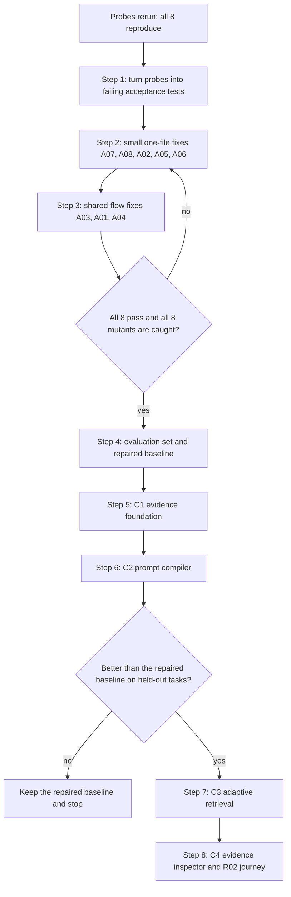

# 50 — Context Compiler: build plan and flow

Date: 2026-09-14. Status: **in progress**. Steps 1–5 are done (the eight fixes, the baseline benchmark, the evidence foundation); steps 6–8
are still plan. It turns
[record 47](47_RAG_AND_CONTEXT_COMPILER_UPGRADE.md) into steps someone can follow, in order, on this repository.
Backlog items C0–C4 in [record 48](48_FEATURE_BACKLOG_2026_09.md) point here.

## Where we start (checked 2026-09-14)

The eight audit probes from record 47 were rerun against this repository from a temporary copy, so the original
evidence was not touched. **All eight still reproduce.** The results, with today's source hashes, are in
`competitive/evidence/2026-09-14-context-audit/rerun-results-in-bimax.json`.

| Bug | What goes wrong | Where it lives today |
|---|---|---|
| A01 | A file rewritten with the same size and time is not re-indexed; compaction restores the old text marked "verified unchanged on disk" | `src/memory/code.index.ts:250` compares only mtime and size; `src/memory/context.manager.ts:533` writes the label |
| A02 | A scoped search returns nothing when the hit is below the first few results; `wanted` also matches `wantedExtra/` | `src/memory/code.index.ts:359-365`: fetches `limit × 4`, then filters with `startsWith` |
| A03 | Recall finds the right document but injects its beginning, not the part that answers | `src/memory/recall.ts:132`: `content.slice(0, budget)` |
| A04 | Recalled text survives compaction with no freshness check, and asking again is suppressed | `src/memory/recall.ts:63-84` suppresses by query key; compaction keeps the `[Recalled memory]` block |
| A05 | A 100-token context pack comes back at about 1,800 tokens, marked not truncated | `src/graph/context.planner.ts:117-132`: only neighbour entries count toward the budget |
| A06 | Graph ranking reuses a stale cache after edges change | `src/graph/pagerank.ts:20-40`: the cache key is node and edge counts |
| A07 | A Hindi search tokenizes to nothing | `src/memory/bm25.ts:49`: `/[^a-z0-9\s]+/` deletes every non-Latin letter |
| A08 | Log compression keeps the first number and drops the maximum | `src/memory/headroom.compress.ts:106-110`: a run of similar lines keeps one representative |

## The flow

In one line: **test the bugs → fix the bugs → measure → build the foundation → build the compiler → prove it
helps → only then add the clever retrieval and the UI.**

## Rules for every step

- **Test first.** A fix counts only when its test failed before the change, passes after it, and fails again when
  the defect is put back (the mutant).
- **One heavy job at a time.** This Mac has 8 GB of RAM. Check imports with `bun build`; run SQLite FTS5 code under
  Bun, because Node 22's `node:sqlite` here has no FTS5.
- **Measure before claiming.** No speed or quality claim without a baseline run on the same models and corpus.
- **Move, don't delete.** Retired code goes to `~/Developer/bimax-archive` at its repo path.
- **Keep the models fixed.** Generation, embedding and reranker stay as configured, so any gain comes from the
  harness.

## Step 1: acceptance tests (C0) — done 2026-09-14

`src/__tests__/context.audit.acceptance.test.ts` states the wanted behaviour for all eight defects. Each check runs
inside `knownDefect`, which passes only while the check fails with an assertion. The day a fix lands, that test turns
red on purpose, and step 2 or 3 replaces `knownDefect` with the plain check. Setup and controls run outside it, so a
broken fixture fails loudly instead of reading as "still broken". The original probe stays unchanged as audit
evidence.

- `npm run test:context` runs the file under Bun: 12 pass, 1 todo. This is the run that covers every defect.
- Jest (`npm test`) runs it too, and skips the three code-index tests (A01's index test and both A02 tests) by name,
  because Node 22's `node:sqlite` on the dev Mac has no FTS5: 9 pass, 3 skipped, 1 todo.
- A01 has two tests: old bytes restored after compaction, and old bytes served by the index.
- A04's second half, "the same question recalls again after compaction", is a `test.todo`. Its state lives in
  `AgentLoop.recalled`, which has no seam yet; step 3 adds the seam and the real test.

## Step 2: small fixes, one file each (C0) — done 2026-09-14

**What shipped.**
- **A07:** `tokenize` keeps letters, combining marks and digits from every script.
- **A08:** a collapsed run of similar lines keeps its representative, and the elision marker now carries the
  range of every number that varies (`… (×39 more similar lines elided; numbers ranged 100–900) …`).
- **A02:** `SearchOptions.where`, a tag predicate applied before depth in both stores; a scoped FTS query reads
  every matching id instead of a fixed window; the code index scope matches whole path segments or one file.
- **A05:** the budget is measured on the rendered pack; a target body that cannot fit keeps its leading lines
  and ends with a note saying where the rest is; a budget too small for the headers returns an error.
  Behaviour change: `GraphContextTool`'s default 1,500-token pack now cuts a large target body instead of
  exceeding the budget.
- **A06:** PageRank and the repo map outline (which had the same stale key) cache per graph object, checked
  against the edge array's identity and the node and edge counts; dangling-node rank is redistributed, so the
  scores sum to 1.

**Proof.**
- The five acceptance tests are plain assertions now, plus two new ones: a one-file scope and the repo map
  outline. Bun: 13 pass, 1 todo. Jest: 10 pass, 3 skipped, 1 todo, no type errors.
- Mutants: putting each old file back failed exactly that defect's tests and no others.
- The 24 related suites show the same 25 Jest failures as before the change, and none new. Those failures
  predate this work: most need FTS5, which Node 22 lacks on the dev Mac.
- The retrieval eval on this repository gives identical numbers before and after (BM25 recall@3/MRR
  0.64/0.542, hybrid 0.61/0.488). It was already failing before step 2, because hybrid MRR sits below BM25's;
  that is step 4's starting point, not a step 2 regression.
- ESLint: 0 errors on the changed files.

**The plan as it was written:**

1. **A07, `bm25.ts`:** tokenize with Unicode classes (letters, marks and numbers), so Hindi vowel signs survive.
   English tokens must come out unchanged.
2. **A08, `headroom.compress.ts`:** when similar lines differ only in numbers, keep the count, minimum and maximum,
   plus the line holding the maximum.
3. **A02, `code.index.ts` and `sqlite.code.store.ts`:** apply the path scope inside the store query, before the
   limit, and match whole path segments (`p === prefix` or `p.startsWith(prefix + '/')`).
4. **A05, `context.planner.ts`:** count the whole rendered pack, target body included. Trim to fit and set
   `truncated`, or return an explicit overflow when even the minimum does not fit.
5. **A06, `pagerank.ts`:** key the cache by a fingerprint of the actual edges (or a generation number bumped on
   every graph change), and redistribute dangling-node mass so the scores sum to 1.

## Step 3: fixes that touch the shared flow (C0) — done 2026-09-14

**What shipped.**
- **A03:** `SearchOptions.passages` makes the memory store return each result's matched chunks, on copies that
  are never stored. Recall injects those chunks, best first within the budget and shown in document order with
  their position, instead of the note's opening.
- **A01:** three places trusted mtime. The code index manifest also records ctime and a content hash: when mtime
  and size match but ctime moved, the file is hashed and re-indexed only if its bytes changed, and an older
  manifest adopts hashes without re-indexing. The read cache stamps entries with mtime, size and ctime, so
  `ReadFileTool` no longer serves a rewritten file from cache. Post-compact restoration re-reads the file and
  compares a hash before saying "verified unchanged on disk"; a large file's preview is never restored as the
  file.
- **A04:** `[Recalled memory]` blocks are transient, so compaction drops them. `AgentLoop.prepareContext` runs
  recall and then compaction each round, and clears the session's recall set when compaction drops a block, so
  the question being worked on recalls its evidence again. The `test.todo` is a real test now.

**Proof.**
- Every acceptance test is a plain assertion; no `knownDefect` remains. Bun: 14 pass. Jest: 11 pass, 3 skipped
  (FTS5).
- Seven mutants, each putting one defect back, failed exactly their own tests. One of them re-indexes on every
  ctime change, which would be a cost regression rather than a wrong answer.
- The 47 suites that import any file changed in steps 2–3: 406 tests pass, and the only failures are the same 25
  that failed before step 2. Of the six suites the audit named, five pass; `memory.retrieval` was already failing
  before step 2.
- The retrieval eval's numbers are unchanged (BM25 0.64/0.542, hybrid 0.61/0.488). ESLint: 0 errors.
- Step 3 changed `agent.loop.ts` again, so the F8 hand port of record 49 must re-find its anchors there.

**C0 is complete.** Next is step 4: the evaluation set and the repaired baseline.

**The plan as it was written:**

1. **A03, `recall.ts` and `vector.store.ts`:** inject the matching chunk plus its bounded neighbours, with a
   locator, instead of the document's opening text.
2. **A01, `context.manager.ts`, `file-state-cache.ts` and `code.index.ts`:** keep mtime and size as a fast hint, but
   verify bytes before any "verified unchanged" label (store a content hash in the file-state cache), and re-hash
   a search hit's file before returning it as current.
3. **A04, `recall.ts` and `context.manager.ts`:** treat a recall block as turn-scoped. Compaction drops it and clears
   its key, so asking again recalls fresh evidence. The key set lives in `AgentLoop.recalled`, so expose that seam
   and turn the A04 `test.todo` into a real test. Step 6 replaces this with the residency ledger.

**Exit:** all eight acceptance tests pass, each of the eight mutants is caught, and the six existing suites named in
the audit's evidence README still pass.

## Step 4: evaluation set and repaired baseline — done 2026-09-14

**What shipped.** `benchmarks/context` (`npm run bench:context`, under Bun): 36 small, fixed cases across record
47's eight families. Each runs the real stage that feeds the prompt and grades the text it produces. No model is
called and the dense stage is off, so a run is free and repeatable; two runs matched on every case, down to the
hash of each graded text. Graders pass their controls before scoring, and a run is invalid rather than failed when
a control fails, FTS5 is missing, or anything touches the network. [DESIGN.md](../../benchmarks/context/DESIGN.md)
says what it does and does not measure.

**The baseline** is run `2026-09-14T06-51-49-224Z_e724750` on commit `e724750`, recorded in
`benchmarks/context/results/`. 25 of 33 graded cases pass, and 3 more are size measurements.

| Family | Passed | Measured |
|---|---|---|
| `single-hop` | 4 of 5 |  |
| `multi-hop-code` | 1 of 3 |  |
| `temporal` | 4 of 4 |  |
| `source-change` | 4 of 5 |  |
| `long-session` | 0 of 3 | 1 |
| `numeric` | 5 of 5 |  |
| `budget` | 2 of 3 | 2 |
| `scope` | 5 of 5 |  |

| Failing | Case | Which later step should fix it |
|---|---|---|
| S5 | no answer exists, so nothing is injected | step 7: evidence sufficiency, so a question with no answer injects nothing |
| M1 | retry change needs the retry code, the cancellation contract and the test | step 7: evidence requirements and graph expansion reach every required file |
| M2 | a low-similarity config limit behind a behaviour question | step 7: evidence requirements and graph expansion reach every required file |
| C4 | a change the index has not synced yet | step 5: bytes are verified when evidence is admitted, not only when the index syncs |
| L1 | the user's constraint survives ten compactions | step 6: the continuation state keeps constraints across compaction |
| L2 | the tested revision survives ten compactions | step 6: the continuation state keeps verified observations across compaction |
| L3 | a failed attempt survives ten compactions | step 6: the continuation state keeps failed attempts across compaction |
| B5 | the answer survives a 600-character recall budget | step 6: representation choice keeps the answering span inside a tight budget |

`temporal` passes in full only because every fixture note carries its own date; it guards against regressions
rather than showing a gap today.

**How later steps use it.** A stage counts as better only when more cases pass and no family's pass count falls. A
smaller prompt never outranks a more correct one. Changing the benchmark itself bumps its version and re-records
the baseline on the same commit first, so every comparison stays like for like.

**The plan as it was written:**

Build the test families from record 47 §6 as small fixed sets: single-hop lookup, multi-hop code, temporal memory,
source changes, long sessions, numeric documents, budget, and scope. Record the model, embedding and reranker
versions and index completeness. Run the repaired code as **the baseline**. Everything after this has to beat it.
If a later stage does not, keep the simpler code.

## Step 5: C1 evidence foundation — done 2026-09-14

**What shipped.**
- `src/context/evidence.ts`: `EvidenceSpan`, in record 47 §3.1's shape (source id, source version, locator, raw handle,
  text, scope, observed time, optional validity fields, dependencies, kind), and `ContextEvidence`, the session's store,
  owned by `ContextManager.evidence`. A version is a sha256 of the text as taken from its source, or `unknown`, and an
  unknown version is never current. `sourceChanged` marks stale exactly the spans taken from another version of a source
  and everything built from them, transitively. `refreshFileSources` re-reads files through record 42's bounded byte
  reader in `src/core/workflow.evidence.ts`.
- `src/context/output.archive.ts`: micro-compaction and the oversized-result cap archive a whole tool result under its
  sha256 before cutting it, and the stub carries `archive:<id>`. `ContextArchiveTool` reads it back and checks the hash.
  It takes a handle, never a path, so a folder-scoped thread can read its own cleared results without widening its
  scope. Results under 512 characters keep the old short stub, because a stub with a handle is longer than they are.
- Adapters where evidence is produced: code search hits (`CodeHit.evidence`); recalled memory chunks
  (`RecalledMemory.evidence`, admitted by `AgentLoop` with a derived span for the recall block); restored files and
  archived tool output, admitted by `ContextManager`.
- `CodeIndex.search` admits a hit only while its file still holds the bytes it was indexed from. A stale hit triggers
  one sync and a fresh search, and anything still stale is dropped.

**Not done in this step, on purpose.** Fact rows and corpus chunks already carry their file, locator and corpus entry;
their span adapters wait for step 6's consumer, so no adapter ships unused. Memory sources are versioned but not
re-checked when a memory is edited. `FreeContextTool` releases are not archived. Only restoration reads staleness so
far; the prompt compiler in step 6 is the real consumer.

**Proof.**
- Both exit conditions are tests in `src/__tests__/context.evidence.test.ts`: every pipeline path admits spans with a
  source, a sha256 version and a scope, and changing one of two inputs invalidates only what was built from it,
  transitively. Bun: 25 pass across the evidence and acceptance files. Jest: 54 pass, 4 skipped (FTS5).
- Nine mutants, one per behaviour, each fail a test. The unknown-version mutant survived at first, because the test
  compared unknown only with a known version; it now also checks unknown against unknown.
- A regression was found and fixed before the commit: replacing a tiny result with a handle stub grew the context and
  tipped a test's window into summarizing.
- The 49 suites importing a changed file: 420 tests pass, and all 26 failures predate step 5. The one not seen in earlier
  runs is `code.only.product.boundary`, which forbids `NSMicrophoneUsageDescription` in `app/electron-builder.yml`. That
  key has been there since at least 2026-09-03 (commit `7693383`). The step 5 commit message blames voice dictation for
  it; that is wrong.
- Benchmark run `2026-09-14T07-12-45-710Z_3cc9dde` on commit `3cc9dde`: **26 of 33**, up from the baseline's 25. C4 now
  passes, and no family's pass count fell. The retrieval eval's numbers are unchanged. ESLint: 0 errors.

**The plan as it was written:**

1. Add shared `EvidenceSpan` and `SourceLocator` types (record 47 §3.1) in one new module.
2. Add adapters that turn code index hits, recall chunks, corpus chunks, FactStore rows and tool outputs into spans.
   Mark existing memories with an unknown version; never invent provenance.
3. Archive raw tool output outside the prompt and hand the model a handle.
4. Record what each derived item was built from, and invalidate dependants when a source's bytes change, reusing
   record 42's byte and directory checks.

**Exit:** every admitted item shows its source, version and scope, and changing one of two inputs invalidates only
the items built from it.

## Step 6: C2 prompt compiler

Start after F8 (record 49's fix) is ported: both touch `agent.loop.ts` and `base.persona.ts`.

1. One allocator owns the whole request budget (record 47 §3.4) at the final request boundary.
2. Each candidate gets several representations (locator, signature, exact span, neighbourhood). Pick them with a
   gain-per-token heuristic, and measure its regret against exact answers on small fixtures.
3. A continuation state extends the existing outcome contract with constraints, verified observations, decisions,
   open questions, failed attempts and the next action. **This is the same design as backlog F2; build it once.**
4. A residency ledger lists what is actually in the prompt; compaction updates it; recall deduplicates against it.
5. Logs keep their raw output, and the prompt gets count, minimum, maximum and representative failures.

**Exit:** the budget holds at the request boundary, and constraints plus exact evidence survive ten compactions.
**Gate:** compare against the step 4 baseline. If it is not better, stop here.

## Step 7: C3 adaptive retrieval

Evidence requirements per step, exact identifiers first, query-seeded graph search compared with a bounded BFS,
selective counter-evidence for decisions and dates, and bounded read-only operations over large outputs (select,
fetch, join, aggregate, diff) through the existing workflow dispatcher and FactStore. **Exit:** better held-out task
outcomes than the baseline, on the same models and resource budget.

## Step 8: C4 qualification

An evidence inspector in the app that reads the evidence record and holds no truth logic of its own, plain
explanations when evidence is stale or missing, cancel and restart behaviour, a packaged build, and the R02 journey
with the acceptance gates. Only then call it Product-ready.

## How this fits the backlog

- The owner decided on 2026-09-14 to build this plan before the other features. The one interruption is F8
  (record 49's fix), which must be ported before step 6.
- Step 5's dependency invalidation is the mechanism backlog L1 (living deliverables) needs, and F4's event wakeups
  can trigger it.
- Step 6 shares its continuation state with F2 and must follow F8.
