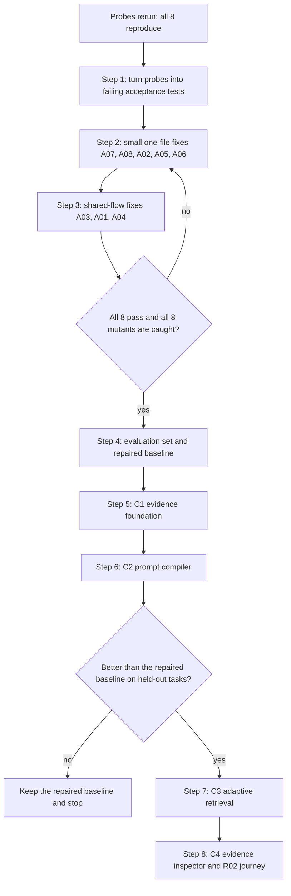

# 50 — Context Compiler: build plan and flow

Date: 2026-09-14. Status: **plan**. Nothing here is built. It turns
[record 47](47_RAG_AND_CONTEXT_COMPILER_UPGRADE.md) into steps someone can follow, in order, on this repository.
Backlog items C0–C4 in [record 48](48_FEATURE_BACKLOG_2026_09.md) point here.

## Where we start (checked 2026-09-14)

The eight audit probes from record 47 were rerun against this repository from a temporary copy, so the original
evidence was not touched. **All eight still reproduce.** The results, with today's source hashes, are in
`competitive/evidence/2026-09-14-context-audit/rerun-results-in-bimax.json`.

| Bug | What goes wrong | Where it lives today |
|---|---|---|
| A01 | A file rewritten with the same size and time is not re-indexed; compaction restores the old text marked "verified unchanged on disk" | `src/memory/code.index.ts:250` compares only mtime and size; `src/memory/context.manager.ts:533` writes the label |
| A02 | A scoped search returns nothing when the hit is below the first few results; `wanted` also matches `wantedExtra/` | `src/memory/code.index.ts:359-365`: fetches `limit × 4`, then filters with `startsWith` |
| A03 | Recall finds the right document but injects its beginning, not the part that answers | `src/memory/recall.ts:132`: `content.slice(0, budget)` |
| A04 | Recalled text survives compaction with no freshness check, and asking again is suppressed | `src/memory/recall.ts:63-84` suppresses by query key; compaction keeps the `[Recalled memory]` block |
| A05 | A 100-token context pack comes back at about 1,800 tokens, marked not truncated | `src/graph/context.planner.ts:117-132`: only neighbour entries count toward the budget |
| A06 | Graph ranking reuses a stale cache after edges change | `src/graph/pagerank.ts:20-40`: the cache key is node and edge counts |
| A07 | A Hindi search tokenizes to nothing | `src/memory/bm25.ts:49`: `/[^a-z0-9\s]+/` deletes every non-Latin letter |
| A08 | Log compression keeps the first number and drops the maximum | `src/memory/headroom.compress.ts:106-110`: a run of similar lines keeps one representative |

## The flow

In one line: **test the bugs → fix the bugs → measure → build the foundation → build the compiler → prove it
helps → only then add the clever retrieval and the UI.**

## Rules for every step

- **Test first.** A fix counts only when its test failed before the change, passes after it, and fails again when
  the defect is put back (the mutant).
- **One heavy job at a time.** This Mac has 8 GB of RAM. Check imports with `bun build`; run SQLite FTS5 code under
  Bun, because Node 22's `node:sqlite` here has no FTS5.
- **Measure before claiming.** No speed or quality claim without a baseline run on the same models and corpus.
- **Move, don't delete.** Retired code goes to `~/Developer/bimax-archive` at its repo path.
- **Keep the models fixed.** Generation, embedding and reranker stay as configured, so any gain comes from the
  harness.

## Step 1: acceptance tests (C0) — done 2026-09-14

`src/__tests__/context.audit.acceptance.test.ts` states the wanted behaviour for all eight defects. Each check runs
inside `knownDefect`, which passes only while the check fails with an assertion. The day a fix lands, that test turns
red on purpose, and step 2 or 3 replaces `knownDefect` with the plain check. Setup and controls run outside it, so a
broken fixture fails loudly instead of reading as "still broken". The original probe stays unchanged as audit
evidence.

- `npm run test:context` runs the file under Bun: 12 pass, 1 todo. This is the run that covers every defect.
- Jest (`npm test`) runs it too, and skips the three code-index tests (A01's index test and both A02 tests) by name,
  because Node 22's `node:sqlite` on the dev Mac has no FTS5: 9 pass, 3 skipped, 1 todo.
- A01 has two tests: old bytes restored after compaction, and old bytes served by the index.
- A04's second half, "the same question recalls again after compaction", is a `test.todo`. Its state lives in
  `AgentLoop.recalled`, which has no seam yet; step 3 adds the seam and the real test.

## Step 2: small fixes, one file each (C0)

Smallest first, so each one lands and is proven before the next:

1. **A07, `bm25.ts`:** tokenize with Unicode classes (letters, marks and numbers), so Hindi vowel signs survive.
   English tokens must come out unchanged.
2. **A08, `headroom.compress.ts`:** when similar lines differ only in numbers, keep the count, minimum and maximum,
   plus the line holding the maximum.
3. **A02, `code.index.ts` and `sqlite.code.store.ts`:** apply the path scope inside the store query, before the
   limit, and match whole path segments (`p === prefix` or `p.startsWith(prefix + '/')`).
4. **A05, `context.planner.ts`:** count the whole rendered pack, target body included. Trim to fit and set
   `truncated`, or return an explicit overflow when even the minimum does not fit.
5. **A06, `pagerank.ts`:** key the cache by a fingerprint of the actual edges (or a generation number bumped on
   every graph change), and redistribute dangling-node mass so the scores sum to 1.

## Step 3: fixes that touch the shared flow (C0)

1. **A03, `recall.ts` and `vector.store.ts`:** inject the matching chunk plus its bounded neighbours, with a
   locator, instead of the document's opening text.
2. **A01, `context.manager.ts`, `file-state-cache.ts` and `code.index.ts`:** keep mtime and size as a fast hint, but
   verify bytes before any "verified unchanged" label (store a content hash in the file-state cache), and re-hash
   a search hit's file before returning it as current.
3. **A04, `recall.ts` and `context.manager.ts`:** treat a recall block as turn-scoped. Compaction drops it and clears
   its key, so asking again recalls fresh evidence. The key set lives in `AgentLoop.recalled`, so expose that seam
   and turn the A04 `test.todo` into a real test. Step 6 replaces this with the residency ledger.

**Exit:** all eight acceptance tests pass, each of the eight mutants is caught, and the six existing suites named in
the audit's evidence README still pass.

## Step 4: evaluation set and repaired baseline

Build the test families from record 47 §6 as small fixed sets: single-hop lookup, multi-hop code, temporal memory,
source changes, long sessions, numeric documents, budget, and scope. Record the model, embedding and reranker
versions and index completeness. Run the repaired code as **the baseline**. Everything after this has to beat it.
If a later stage does not, keep the simpler code.

## Step 5: C1 evidence foundation

1. Add shared `EvidenceSpan` and `SourceLocator` types (record 47 §3.1) in one new module.
2. Add adapters that turn code index hits, recall chunks, corpus chunks, FactStore rows and tool outputs into spans.
   Mark existing memories with an unknown version; never invent provenance.
3. Archive raw tool output outside the prompt and hand the model a handle.
4. Record what each derived item was built from, and invalidate dependants when a source's bytes change, reusing
   record 42's byte and directory checks.

**Exit:** every admitted item shows its source, version and scope, and changing one of two inputs invalidates only
the items built from it.

## Step 6: C2 prompt compiler

Start after F8 (record 49's fix) is ported: both touch `agent.loop.ts` and `base.persona.ts`.

1. One allocator owns the whole request budget (record 47 §3.4) at the final request boundary.
2. Each candidate gets several representations (locator, signature, exact span, neighbourhood). Pick them with a
   gain-per-token heuristic, and measure its regret against exact answers on small fixtures.
3. A continuation state extends the existing outcome contract with constraints, verified observations, decisions,
   open questions, failed attempts and the next action. **This is the same design as backlog F2; build it once.**
4. A residency ledger lists what is actually in the prompt; compaction updates it; recall deduplicates against it.
5. Logs keep their raw output, and the prompt gets count, minimum, maximum and representative failures.

**Exit:** the budget holds at the request boundary, and constraints plus exact evidence survive ten compactions.
**Gate:** compare against the step 4 baseline. If it is not better, stop here.

## Step 7: C3 adaptive retrieval

Evidence requirements per step, exact identifiers first, query-seeded graph search compared with a bounded BFS,
selective counter-evidence for decisions and dates, and bounded read-only operations over large outputs (select,
fetch, join, aggregate, diff) through the existing workflow dispatcher and FactStore. **Exit:** better held-out task
outcomes than the baseline, on the same models and resource budget.

## Step 8: C4 qualification

An evidence inspector in the app that reads the evidence record and holds no truth logic of its own, plain
explanations when evidence is stale or missing, cancel and restart behaviour, a packaged build, and the R02 journey
with the acceptance gates. Only then call it Product-ready.

## How this fits the backlog

- The owner decided on 2026-09-14 to build this plan before the other features. The one interruption is F8
  (record 49's fix), which must be ported before step 6.
- Step 5's dependency invalidation is the mechanism backlog L1 (living deliverables) needs, and F4's event wakeups
  can trigger it.
- Step 6 shares its continuation state with F2 and must follow F8.
